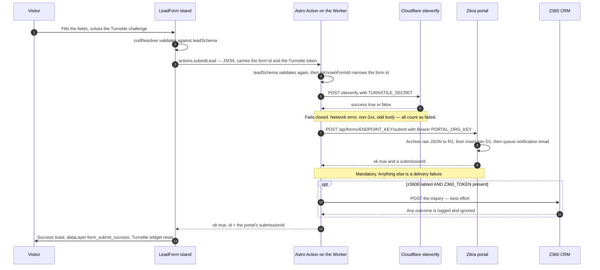

# Forms — the complete guide

How a lead actually travels from a visitor's keyboard to the Zikra portal, which credential
authenticates that hop and why there is only ever one of them, what happens when any of it
breaks, and how to extend it.

**The one sentence to remember:** the Zikra portal is the _only_ place a lead is ever stored,
so the site's push to it is unconditional and hard-failing — if the portal does not confirm
the write, the visitor sees an error and can retry, because a lead that looks sent but was
never recorded is the one outcome this whole design exists to prevent.

**The second sentence:** **one key per organization.** `PORTAL_ORG_KEY` holds the org's `pok_…`
API key, and that single key authenticates every form in the organization on every website in
it. Adding a form is a line in a registry, never a new secret.

> **Just spinning up a new site?** Follow **[`SETUP.md`](./SETUP.md)** — it is the ordered,
> copy-pasteable walkthrough from "Use this template" to a live, verified site. This file is
> deliberately _not_ a second copy of it. Come back here for the mechanism, the credential
> lifecycle, and the failure modes.

| You want…                                  | Go to                                    |
| ------------------------------------------ | ---------------------------------------- |
| The ordered how-to for a new site          | [`SETUP.md`](./SETUP.md)                 |
| Why the pipeline is shaped this way        | this file                                |
| The architecture summary                   | [`AGENTS.md` §5](./AGENTS.md)            |
| The deploy checklist (as an agent)         | the `zikra-deploy` skill                 |
| To add or change a form (as an agent)      | the `zikra-form` skill                   |
| Analytics wiring for `form_submit_success` | [`ANALYTICS-SEO.md`](./ANALYTICS-SEO.md) |

---

## 1. How a submission actually travels

### The path



### Hop by hop

**1. The island.** `src/components/LeadForm.tsx` is a React island — the only JavaScript a
page with a form ships. It renders the shared `name` / `email` / `phone` / `message` fields,
any per-form `extraFields`, and the Turnstile widget. `react-hook-form` validates against the
shared `leadSchema` before anything leaves the browser. The submit button stays disabled until
the Turnstile widget hands back a token, because the server fails closed on a missing one and a
visitor cannot act on that error.

**2. The Action.** `src/actions/index.ts` exports exactly one Astro Action, `submitLead`,
for **every** form on the site. It runs on the Cloudflare Worker (the one on-demand route on
an otherwise fully prerendered site). It re-validates the payload with the same `leadSchema` —
client validation is UX, server validation is the rule — and delegates to `processLead` in
`src/lib/lead-pipeline.ts`, which is where ordering and failure policy live.

The submitted `form` field is then checked against the `FORMS` registry by `isKnownFormId`
before anything else happens. An id that is not in the registry is rejected with `BAD_REQUEST`
at the edge of the Action and never becomes a URL. (`isKnownFormId` uses `Object.hasOwn`, not
`in`: `in` walks the prototype chain, so `"toString"` or `"__proto__"` would pass and then
index into `FORMS` as a prototype method.)

That membership check lives on the **server**, not in `leadSchema`, on purpose. The schema is
shared with the browser island, so anything it imports is bundled into the JavaScript served
to every visitor — and a `z.enum` built from `FORMS` would drag the whole registry, including
every form's portal `endpointKey`, into page source. The schema therefore only shape-checks
the field (`z.string().min(1).max(64)`), and `src/config.public.ts` holds the one config value
an island legitimately needs (the public Turnstile sitekey). Islands import **values** from
`@/config.public` and **types** from `@/config` with `import type`, which is erased at compile
time and creates no bundle edge.

**3. Turnstile — verified at the site, and nowhere else.** `verifyTurnstile` POSTs the token
and `TURNSTILE_SECRET` to Cloudflare's siteverify endpoint (10 s timeout).

> **Why only here?** A Turnstile token is **single-use**. The first party to redeem it at
> siteverify consumes it; anyone who redeems it afterwards gets `timeout-or-duplicate`. So
> exactly one party in the chain may verify, and that party is the site — it is the one that
> rendered the widget and knows the challenge belongs to this submission. The portal therefore
> runs **no** challenge check at all (it goes as far as deleting any legacy
> `cf-turnstile-response` field from the payload so it is never even stored), and
> `buildPortalPayload` deliberately does not forward the token.

The verifier **fails closed**: a network error, a timeout, a non-2xx status, or a body that is
not the JSON we expect all count as a failed challenge. A siteverify outage means visitors
briefly cannot submit; failing open would mean the form is briefly unprotected. Failure raises
a `spam` failure, which the Action turns into a `FORBIDDEN` `ActionError`.

**4. The portal — mandatory, hard-failing.** `submitToPortal` POSTs the lead in **server mode**
to `PORTAL_API_BASE + /api/forms/<endpointKey>/submit` with
`Authorization: Bearer <PORTAL_ORG_KEY>` (15 s timeout). Server mode is what the bearer buys:
the portal skips its browser-origin allowlist check entirely.

> **The split that makes one key enough.** The `endpointKey` in the URL **identifies** the
> form — it is the _only_ thing that tells the portal which form a submission belongs to. The
> bearer only **authenticates** the caller; it never has to _select_ anything. Two different
> jobs, two different values, and only the second one is a secret. That is precisely why a
> single organization key is correct for every form in the org: routing has already happened
> by the time the credential is read. See §2.

On the portal side the write order is deliberate: the raw submission is archived to an R2 bucket
**before** the D1 insert (either store alone can recover the lead), and the notification email is
sent afterwards, outside the response, so an email provider outage can never lose or delay a
submission. Recipients are configured **in the portal**, not per site — which is why this
starter has no `adminEmail` and no email provider of its own.

> **Why this push must hard-fail.** The site keeps **no local copy** of a lead. No R2 backup,
> no fallback email, no queue. The portal is the single durable sink. A best-effort push would
> therefore silently drop the lead the moment the portal hiccups. So any throw, any non-ok
> status, and any 2xx that does not carry the portal's `{ ok: true, submissionId }`
> confirmation is logged and raised as a `delivery` failure. The visitor sees
> "We couldn't send your message. Please try again." and can retry.

Two details that make "did it really store?" answerable rather than assumed:

- `redirect: "manual"` — a misrouted POST (an Access login page, an apex→www hop, a maintenance
  page) surfaces as a 3xx instead of being followed into some other page whose `200` would look
  exactly like a stored lead.
- **A bare 2xx proves nothing.** Only `{ ok: true, submissionId }` counts. Anything else — HTML,
  `ok: false`, a missing id, an unparseable body — is treated as lost.

The id returned to the browser is the portal's `submissionId`, because that is the only id that
names a stored record. (A locally generated UUID also exists, but purely as a log correlation
id: it ties the log lines of one attempt together even when the portal call is what failed.)

**5. Z360 — optional, last, best-effort.** Only when `SITE.z360Enabled` **and** the `Z360_TOKEN`
secret are both present. It runs _after_ the lead is already safe in the portal, so a non-ok
response or a throw is logged and the submission still succeeds. Its timeout is the tightest of
the three (5 s) precisely because every second it stalls is a second a delivered lead spends
looking undelivered to the visitor. Turning it on is three settings — see §3.

### Timeouts

`fetch` has no deadline of its own, so every outbound call carries an explicit
`AbortSignal.timeout`. Without them, an endpoint that accepts the connection and then goes
silent would stall the Action until the runtime killed the invocation — skipping the logging
branches entirely.

| Call      | Budget | Why that number                                                         |
| --------- | ------ | ----------------------------------------------------------------------- |
| Turnstile | 10 s   | Cloudflare's own edge endpoint; loose enough never to bounce a visitor. |
| Portal    | 15 s   | The only sink, so the most generous budget — but still bounded.         |
| Z360      | 5 s    | Already-delivered lead; a stall here can only hurt.                     |

---

## 2. The portal credential — one key per organization

**One key per organization. That is the standard, everywhere.** `PORTAL_ORG_KEY` holds the
organization's `pok_…` API key, and that one key is valid for every form in the org and every
website in it — one form or ten, one site or five, the same key.

It works for the reason §1 sets out: the form is **already identified** by the endpoint key in
the URL, so the bearer never has to _select_ anything. It only has to prove the caller is
allowed to post here, and the org key answers that question for the whole org. This is why
adding a form is a line in the `FORMS` registry and never a new secret — and why a site's
secret list is fixed at two (this key and `TURNSTILE_SECRET`) however far the registry grows.

The pipeline is built around that singularity, not merely compatible with it: the Worker binds
exactly one `PORTAL_ORG_KEY`, and `processLead` sends that one bearer with every submission
whatever the form id. There is nowhere for a second portal credential to live. `tests/lead-pipeline.test.ts`
pins the behaviour — two different forms, two different endpoints, one identical key.

### The trade-off, stated plainly

One key for the whole organization means one key's worth of blast radius. **If it leaks, every
form on every website in the org is exposed** until it is rotated. And **rotation is
coordinated work**: the old key dies the instant the rotation commits, org-wide, with no grace
period — so every site deploying that key has to be updated in the same pass, and any site you
forget starts hard-failing on real leads.

A per-form token limits both of those to one form. We take the trade deliberately anyway,
because the alternative is a secret per form per site: forgotten rotations, sites deployed with
the wrong token, and a second form that quietly `401`s because nobody realised it needed its
own. One credential everybody knows to rotate together beats N credentials nobody tracks. If a
particular site genuinely must hold a credential scoped to a single form, the legacy per-form
token below still exists for exactly that case.

### Generating

Portal → **Settings → API key** → **Generate key**. The key is displayed **exactly once**; only
its SHA-256 hash is stored, so nothing can recover the raw value afterwards. Copy it into a
password manager at that moment — a human then sets it as a Worker Secret
(`wrangler secret put PORTAL_ORG_KEY`) and, for local work, into the gitignored `.dev.vars`.

**If the org already has a key, this step is already done**: reuse the existing value for the
new site. Generate deliberately refuses to overwrite a live key — it errors with "this
organization already has an API key — rotate it instead" — because silently replacing one would
break every site using it with no record of when or why.

### How the portal decides

On each submission the portal hashes the presented bearer once, then compares that digest —
with a timing-safe comparison — against, in order:

1. the form's own `privateTokenHash` (the legacy `pfk_…` token);
2. if that misses, the `apiKeyHash` of **the organization that owns this form**, looked up by
   `form.organizationId`.

That order is a **cost** ordering, not a preference: the form row is already in hand while the
org key needs a second query. The second lookup is scoped to the form's own org on purpose —
an org key can never authenticate another organization's form. An org with no key configured
has a `NULL` hash, which matches nothing at all, including an empty bearer.

Note that the form is looked up and status-checked **before** any credential is read, so a
paused or unknown form answers `404` no matter which credential you present.

### Rotating

Rotation takes effect **immediately — there is no grace period.** The old credential stops
working the moment the rotation commits.

```bash
# After rotating in the portal UI (Settings → API key → Rotate key), a human
# pushes the new value to every affected Worker:
pnpm wrangler secret put PORTAL_ORG_KEY
```

> **Rotating an org key means every site using it must be updated together.** The old key dies
> instantly and org-wide. A site you forget starts hard-failing on **real leads** — every
> submission returns a 401 from the portal, the Worker logs `lead_portal_failed` with
> `status: 401`, and every visitor sees the retry error. Plan the rotation as one coordinated
> pass over all sites, and re-test a submission on each one afterwards.

The portal's own confirmation dialog says the same thing before it commits.

### Revoking

**Settings → API key → Revoke key** sets the hash back to `NULL`, which the intake endpoint
reads as "no org key configured". Every form in the org then authenticates with its own legacy
`pfk_…` token and nothing else — so **any site still deploying the `pok_…` key starts failing
immediately**, and those sites do not hold the per-form tokens. Since the org key is what every
site is meant to carry, revoking is almost never what you want: **rotate** instead, and push the
new value to every site in one coordinated pass.

Generate, rotate and revoke are all recorded in the portal's audit log
(`org.api_key_generated` / `org.api_key_rotated` / `org.api_key_revoked`).

### Legacy: per-form tokens (`pfk_…`)

**Still accepted. Not the path for a new site.**

Every form still mints a `pfk_…` token when it is created — `forms.private_token_hash` is
`NOT NULL`, so one exists whether or not anyone uses it — and the intake endpoint still checks
it first, before it even looks up the org key. That will not change: live integrations hold
these tokens and must keep working. The portal shows the token once in the create-form dialog,
clearly labelled **Legacy**, and it can be rotated later from the form's detail page (Form
controls → rotate).

Why it is not the documented path:

|                                | `pok_…` org key — **the standard**            | `pfk_…` per-form token — legacy                      |
| ------------------------------ | --------------------------------------------- | ---------------------------------------------------- |
| **Scope**                      | Every form in the org, on every website in it | Exactly one form                                     |
| **Where it comes from**        | Portal → Settings → API key → Generate key    | Shown once when the form is created                  |
| **Rotate from**                | Settings → API key → Rotate key               | The form's detail page → Form controls               |
| **Blast radius of a leak**     | Every form in the org, on every site          | That one form                                        |
| **Secrets to deploy per site** | One, forever, however many forms are added    | One **per form** — a sixth form means a sixth secret |
| **Status**                     | **The standard.** What every new site uses    | Legacy — accepted, no longer documented              |

Both are shown exactly once and stored only as a SHA-256 hash; if either is lost, rotate it.

A per-form token cannot serve a multi-form site here at all. The Worker binds one
`PORTAL_ORG_KEY` and sends it for every form, so a site left on the contact form's token would
push that token for quote submissions too — and the portal, which only ever consults that form's
own hash and its org's key, would answer `401` on every real quote lead.

**Moving a legacy site to the org key** (do this before it gains a second form): generate or
reuse the org key in the portal, `pnpm wrangler secret put PORTAL_ORG_KEY`, redeploy, submit a
test lead on each form. Nothing changes in the portal, and the old `pfk_…` token keeps working
throughout — there is no cutover moment, no migration step, and no deadline.

---

## 3. Configuration: what lives where

> The ordered, copy-pasteable setup for a brand-new site lives in **[`SETUP.md`](./SETUP.md)**.
> This section is the model behind it — which mechanism holds which value, and why.

### The distinction that breaks sites when it is missed

There are **two** environment mechanisms in this repo, they are read at different times, and
mixing them up fails quietly.

|                     | `.env` → build-time                                                                           | `.dev.vars` / Worker Secrets → runtime                      |
| ------------------- | --------------------------------------------------------------------------------------------- | ----------------------------------------------------------- |
| **Read when**       | The site is **built** (Astro/Vite `import.meta.env`)                                          | The **Worker runs**                                         |
| **Ends up**         | Baked into the bundle — public                                                                | In the Worker's secret store — never in the bundle          |
| **Holds**           | `PUBLIC_TURNSTILE_SITE_KEY`, `PORTAL_API_BASE`                                                | `TURNSTILE_SECRET`, `PORTAL_ORG_KEY`, `Z360_TOKEN`          |
| **Local file**      | `.env` (copy `.env.example`, gitignored)                                                      | `.dev.vars` (copy `.dev.vars.example`, gitignored)          |
| **Production**      | **Build** environment variables: Cloudflare dashboard → Worker → Settings → Build, or your CI | `pnpm wrangler secret put <NAME>`                           |
| **Read in code by** | `src/config.public.ts` / `src/config.ts`, via `import.meta.env`                               | `src/actions/index.ts`, via `env` from `cloudflare:workers` |
| **Never**           | Put a secret here                                                                             | Put a build value here                                      |

Both build-time variables are optional: `src/config.public.ts` falls back to Cloudflare's
"always passes" test sitekey and `src/config.ts` falls back to the production portal origin, so
a fresh clone builds and runs with no `.env` at all. A blank value counts as unset — `fromBuildEnv`
treats an empty string as missing, because a blank sitekey breaks every form while looking
configured.

**Why the Turnstile _site_ key is build-time and not a secret:** the widget renders in the
browser, so that key is served to every visitor no matter where it is stored — it is public by
definition. It also _could not_ work as a Worker Secret: pages here are prerendered
(`output: "static"`), so nothing runtime-only is reachable from the client JS that renders the
widget without server-rendering the page or paying for an extra round trip first. The `PUBLIC_`
prefix is what makes Astro expose it to client code; it is required.

**Why `PORTAL_API_BASE` is build-time but carries no `PUBLIC_` prefix:** only the server-side
Action ever builds a submit URL from it, so the value is inlined into the Worker bundle and
never has to reach the browser. It is build-time so a staging build can aim at a staging portal
without editing code.

**Never** read a secret from `import.meta.env` or `process.env`, and never hardcode one.
`TURNSTILE_SECRET` and `PORTAL_ORG_KEY` are declared **required** in `wrangler.jsonc`, so
Wrangler validates them at deploy time and a deploy missing either one fails rather than
shipping a site whose forms are broken. `Z360_TOKEN` is optional and is therefore hand-declared
in `src/env.d.ts` instead.

### Who sets the secrets

Secret _values_ are a human's job in this repo, and that is enforced, not merely advised:
`Bash(wrangler secret put:*)` is on the deny list in `.claude/settings.json`, and
`Read(./.dev.vars)` with it. An agent can create the Turnstile widget, edit `src/config.ts`,
run `pnpm cf-typegen`, and build — but a human runs `wrangler secret put` and pastes the values.

Note also that `wrangler turnstile widget create` **prints the secret key to stdout**. Never
paste that output into a file, a commit, a ticket, or a chat window; copy the secret straight
into a password manager and set it from there.

### Turning on the Z360 CRM push

Off by default, and safe to turn on: it runs **last**, after the lead is already committed in
the portal, and it is best-effort — a non-ok response or a throw is logged
(`lead_z360_failed` / `lead_z360_errored`) and the visitor still sees success. It cannot break
a form.

Three settings, in `src/config.ts` and the Worker secrets:

1. **`SITE.z360Enabled: true`** — the feature switch.
2. **`SITE.z360InquiriesUrl`** — the CRM's inquiries endpoint. The template ships
   `https://api.z360.example/v1/inquiries`, a **placeholder**; `src/lib/z360.ts` carries an open
   item saying the real URL and payload shape still need confirming with the Z360 team.
3. **`Z360_TOKEN`** — the Worker secret (`wrangler secret put Z360_TOKEN` in production, a value
   in `.dev.vars` for local testing). It is deliberately **not** in `wrangler.jsonc`'s required
   list — it is hand-declared as optional in `src/env.d.ts` — so a deploy without it succeeds.

The gate in `processLead` is `SITE.z360Enabled && Z360_TOKEN` — **both**, so with either one
missing the push is skipped silently. The URL is _not_ part of that gate: enabling the push
while leaving the placeholder URL in place does not skip it, it fails on every lead
(`lead_z360_errored` for a DNS or network failure, `lead_z360_failed` for a non-ok reply).

What Z360 receives is narrower than what the portal receives: `buildZ360Payload` sends only
`name`, `email`, `phone`, `message` and `source: "website"`. **The `extra` bag is not
forwarded** — per-form fields live in the portal only.

---

## 4. Adding a form

Three edits, **no new secret**, no second Action, no second pipeline, no portal-side setup for
the fields. [`SETUP.md` → Add a second form](./SETUP.md) is the copy-pasteable version; this
section is what each edit does and where the limits are.

### The three edits

**1. Create the form in the portal.** Forms → Add form → name it → tick the websites allowed to
post to it. Copy the **endpoint key** it prints (e.g. `quote_ef34gh`). Ignore the legacy `pfk_…`
token in that dialog (§2). The allowed-website list only gates **browser-mode** posts; this
site submits in server mode, which skips that check.

**2. Add one line to the registry.**

```diff
  // src/config.ts
  export const FORMS = {
    contact: { endpointKey: "contact_ab12cd", label: "Contact" },
+   quote: { endpointKey: "quote_ef34gh", label: "Quote request" },
  } as const satisfies Record<string, FormConfig>;
```

That single line is enough to make `"quote"` a valid form id — `isKnownFormId` and `FORM_IDS`
both read the registry directly, so they can never drift — and to make `portalSubmitUrl("quote")`
resolve to the new endpoint. (`leadSchema` only shape-checks the field; the registry check is
server-side on purpose, see §1.)

The registry key is the **form id**. It travels with every submission, names the Turnstile
widget `action` in Cloudflare's analytics, and tags the `form_submit_success` dataLayer event as
`form_id`. Keep it short and to alphanumerics plus `_` / `-` — Turnstile caps the action at 32
characters.

**3. Render the island on a page**, with an explicit `client:*` directive:

```tsx
<LeadForm
  client:load
  formId="quote"
  heading="Project details"
  submitLabel="Request quote"
  messageLabel="What do you need built?"
  extraFields={[
    { name: "company", label: "Company", required: true },
    { name: "budget", label: "Budget range", placeholder: "e.g. $10k–25k" },
  ]}
/>
```

`ContactForm.tsx` is a thin preset that renders `<LeadForm formId="contact" />` — it exists so
the one form every site starts with keeps a friendly name. For any other form, render
`<LeadForm formId="…" />` directly. Never clone `LeadForm` to make a variant; add a prop
instead.

### About `extraFields`

Each entry renders one additional input and is submitted inside the `extra` bag, a flat
`Record<string, string>`.

| Prop          | Meaning                                                                                                                                                                                                                                        |
| ------------- | ---------------------------------------------------------------------------------------------------------------------------------------------------------------------------------------------------------------------------------------------- |
| `name`        | The key the answer is stored under, both in the react-hook-form path (`extra.<name>`) and in the payload the portal keeps. Must be a plain identifier — `.`, `[`, `]`, `'` and `"` are rejected (see below). Keep it stable: a human reads it. |
| `label`       | Visible label, tied to the input. Required — accessibility is not optional.                                                                                                                                                                    |
| `type`        | `"text"` (default), `"tel"`, or `"email"`.                                                                                                                                                                                                     |
| `required`    | Enforced by extending the shared zod schema **in the island**, not by the HTML attribute — the form sets `noValidate`, so an HTML-only rule would be decoration.                                                                               |
| `placeholder` | Optional hint text.                                                                                                                                                                                                                            |

**The portal needs no setup for any of this.** It stores the entire payload verbatim and
auto-extracts `name` / `email` / `phone` / `message` for its dashboard columns; everything else
rides along and appears on the submission as-is. So a new per-form field is a one-line change on
the site and _zero_ changes in the portal.

Three guardrails worth knowing:

- **Names must be flat.** `extra.<name>` is a react-hook-form _path_, not a key, so a name like
  `budget.range` would write a nested object that `leadSchema` then rejects at a path no
  `<FormMessage />` is watching — no toast, no request, the lead silently gone.
  `assertFlatExtraFieldNames` throws on those characters instead, and because the island is
  server-rendered at build time that throw fails `pnpm build` on your machine rather than eating
  submissions in production.
- **The bag is bounded** by `leadSchema`: **max 25 keys**, key names **1–64 characters**, values
  **≤ 2000 characters**. Those caps are the only thing between a crafted POST and an unbounded
  row in the portal — do not loosen them casually.
- **The normalized fields always win.** `buildPortalPayload` **strips every key the portal's
  extraction answers to** — `name` / `email` / `phone` / `message`, each of their aliases
  (`full_name`, `email_address`, `tel`, `inquiry`, …), and `source` — from the bag before
  merging it, matching case-insensitively. So neither `extra: { email: "…" }` nor
  `extra: { Email: "…" }` can displace the validated email the portal extracts, notifies on,
  and replies to. Dropping them is what makes the guarantee hold: the portal matches those
  fields case-insensitively and first-wins, so a surviving `Email` would beat the validated
  `email` rather than be overwritten by it. `tests/lead.test.ts` pins this. Do not name an
  `extraFields` entry after one of those keys — it would be silently dropped; give it a
  form-specific name instead.

`required` on an extra field is a **client-side UX rule**, not a server rule: the server keeps
validating with the plain shared schema, because the presence of a per-form field is not a "was
this lead worth storing" question — a partially filled lead in the portal beats no lead at all.

### When to change the shared schema instead

Only when a field belongs to **every** form on **every** site. Anything form-specific belongs in
`extra`. `src/lib/schema.ts` must never import from `astro:*` — it is imported by both the island
and the server, and staying framework-free is what keeps it plain-Vitest testable. It must not
import `@/config` either, for the bundle reason in §1.

---

## 5. What happens when things fail

A visitor only ever sees the short copy the Action throws — in practice two messages, one for a
failed spam check and one for everything else. The detail is in the logs: one JSON line per
event, each carrying the `leadId` correlation id **and the `form` id**, because on a multi-form
site "the portal rejected a lead" is only actionable once you know _which_ form it was. Since
the org key is shared by every form, that is exactly the part that varies: a failure on one form
and not the others points at that form's endpoint key, while a failure on every form points at
the key.

| What failed                                                            | Visitor sees                                       | Logged event                                      | Lead stored?            | What to do                                                                                                             |
| ---------------------------------------------------------------------- | -------------------------------------------------- | ------------------------------------------------- | ----------------------- | ---------------------------------------------------------------------------------------------------------------------- |
| Turnstile says no (bot, expired token, replayed token, wrong hostname) | "Spam check failed. Please try again."             | _(no log line — the verifier just returns false)_ | No                      | Usually genuine. If real users hit it, check the widget hostname list and that the sitekey/secret are a matching pair. |
| siteverify unreachable, times out, or answers oddly                    | "Spam check failed. Please try again."             | _(no log line)_                                   | No                      | Fails closed by design. Check Cloudflare status; visitors can retry.                                                   |
| Portal unreachable — DNS, network, 15 s timeout                        | "We couldn't send your message. Please try again." | `lead_portal_errored` (with the error message)    | **No**                  | Check portal health and `PORTAL_API_BASE`. The visitor must retry.                                                     |
| Portal answered non-2xx — 401, 404, 429, 5xx, or a 3xx redirect        | "We couldn't send your message. Please try again." | `lead_portal_failed` (with `status`)              | **No**                  | See §6 — the status tells you which.                                                                                   |
| Portal answered 2xx but without `{ ok: true, submissionId }`           | "We couldn't send your message. Please try again." | `lead_portal_unconfirmed` (with `status`)         | **Unknown — assume no** | Something other than the portal answered at that URL (login page, maintenance page, wrong host). Fix the URL.          |
| Z360 answered non-2xx                                                  | _Nothing — success toast_                          | `lead_z360_failed` (with `status`)                | **Yes, in the portal**  | Fix at leisure. Backfill from the portal if the CRM matters.                                                           |
| Z360 threw or timed out (5 s)                                          | _Nothing — success toast_                          | `lead_z360_errored` (with the error message)      | **Yes, in the portal**  | Same. Best-effort by design.                                                                                           |
| Unknown form id in the payload                                         | "Unknown form."                                    | _(none — the Action rejects with `BAD_REQUEST`)_  | No — nothing was sent   | A misconfigured page or a hand-crafted POST. Check the `formId` prop against the `FORMS` registry.                     |
| Portal's own R2 archive write failed                                   | _Nothing — success toast_                          | `submission_archive_failed` **(portal-side log)** | **Yes, in D1**          | Portal-side. The D1 row still exists; the immutable audit copy does not.                                               |
| The Action call itself rejected mid-flight (browser dropped it)        | "We couldn't send your message. Please try again." | _(browser-side only)_                             | **No**                  | Network flake. The island resets Turnstile so a retry gets a fresh token.                                              |

Read the Worker logs with:

```bash
pnpm wrangler tail
```

Observability is enabled in `wrangler.jsonc` with `head_sampling_rate: 1`, so these lines are
also queryable in the Cloudflare dashboard's Workers Logs.

**After every submit — success or failure — the island resets the Turnstile widget.** This is
load-bearing, not cosmetic: tokens are single-use, so a retry that reused a redeemed token would
be rejected as `timeout-or-duplicate` and the visitor would be stuck in a loop they cannot
escape.

---

## 6. Troubleshooting

### `lead_portal_failed` with `status: 401`

The portal found the form but rejected the credential. In order of likelihood:

1. **Wrong or stale key.** Someone rotated the org key (or, on a legacy site, the form token)
   and this site was not updated. Re-run `pnpm wrangler secret put PORTAL_ORG_KEY` with the
   current value. A rotation is org-wide, so expect every site to need this.
2. **Org key used against another org's form.** An org key only ever authenticates forms owned by
   _its own_ organization. If the endpoint key in `FORMS` belongs to a different org, no org key
   will open it — move the form into the org whose key this site deploys, or deploy that other
   org's key instead. A single site cannot straddle two orgs: it binds one key.
3. **Empty key.** A blank `PORTAL_ORG_KEY` still sends an `Authorization` header, so the portal
   takes the server-mode path and answers `401` rather than falling back to browser mode.
   A fresh clone with `PORTAL_ORG_KEY=""` in `.dev.vars` behaves exactly this way.
4. **The org key was revoked.** Revoking sets the hash to `NULL`, and a `NULL` hash matches
   nothing — including an empty bearer. Generate a new org key and push it to every site (§2:
   rotate rather than revoke).
5. **A legacy site that grew a second form.** The one bound token authenticates only its own
   form, so the new form `401`s on every lead. Move the site to the org key (§2).

### `lead_portal_failed` with `status: 404`

The portal did not recognize the endpoint key, or the form is not `active`. The form lookup runs
**before** the credential check, so the credential is irrelevant here.

- **Wrong endpoint key** in `FORMS`. Re-copy it from the form's detail page in the portal.
  A fresh clone ships the placeholder `contact_abc123`, which no portal will ever recognize —
  this is one of the first things to change on a new site.
- **The form is paused.** A paused form answers `404` no matter which credential you present.
  Re-activate it in the portal.
- **A trailing slash on `PORTAL_API_BASE`** would produce `…//api/forms/…`, a different path most
  servers answer with `404`. `portalSubmitUrl` strips trailing slashes defensively, but keep the
  value clean anyway.

### `lead_portal_failed` with `status: 429`

Portal rate limits: **10 submissions per minute per IP per form**, and **100 per minute per
form**. In server mode the IP the portal sees is the Worker's, so a burst of legitimate traffic
from one edge location can trip the per-IP limit. Normally this means a bot storm or a load
test; genuine visitors should retry and succeed.

### `lead_portal_unconfirmed`

Something answered 2xx at the submit URL, but it was not the portal — or not the portal's submit
handler. Check `PORTAL_API_BASE` (right origin? right environment?), and check whether the portal
sits behind Cloudflare Access or a maintenance page that returns 200 to unauthenticated requests.

### Turnstile fails locally

- The defaults work out of the box: `src/config.public.ts` falls back to Cloudflare's "always
  passes" **test sitekey** and `.dev.vars.example` ships the matching **test secret**. If you
  replaced one and not the other, they no longer pair and siteverify rejects every token.
  Replace both, or neither.
- If you set a real `PUBLIC_TURNSTILE_SITE_KEY` in `.env` for local work, its widget must list
  `localhost` **and** `127.0.0.1` — those are different hostnames to Turnstile.
- The site key is read at **build** time. Changing `.env` requires a restart (`pnpm dev`) or a
  rebuild (`pnpm preview`) before the new value reaches the browser.

### The widget renders fine but every submission is "Spam check failed"

Almost always a **hostname the widget does not list**. Turnstile happily renders the challenge on
any origin; it is _siteverify_ that checks the hostname, so the failure only appears server-side.
Add the missing hostname:

```bash
pnpm wrangler turnstile widget list
```

```bash
pnpm wrangler turnstile widget update <sitekey> --domain example.com --domain www.example.com --domain localhost --domain 127.0.0.1
```

Other causes: sitekey and secret from **different widgets** (re-check which pair you deployed),
or a preview deployment on a `*.workers.dev` hostname the widget does not cover.

### `timeout-or-duplicate` — a token reused

Turnstile tokens are **single-use and short-lived**. You will see this if something redeems a
token twice: a retry that did not reset the widget, or a proxy/middleware that verifies before
the Action does. The island already resets the widget after every submit, so if you hit this,
look for a second party calling siteverify — and remember the portal deliberately performs no
challenge check, so it is never the culprit.

### A fresh clone hard-fails on submit — and that is correct

Out of the box, the form renders, validates, and passes the Turnstile test challenge, then
returns "We couldn't send your message. Please try again." on submit. This is **deliberate**.
The clone has no real `PORTAL_ORG_KEY` and a placeholder `endpointKey`, and the portal is the
only durable sink — so the pipeline refuses to report success for a lead nothing recorded.

To make it work you need both: a real endpoint key in `FORMS` and the org's real key in
`PORTAL_ORG_KEY` (see [`SETUP.md`](./SETUP.md)). There is no "skip the portal" switch, and
adding one would defeat the entire design.

### Nothing at all happens on submit

Check that the island has a `client:*` directive. Without it, Astro renders the component to
static HTML and never hydrates — no Turnstile widget, no submit handler.

---

## 7. Where the code lives

### This repo

| File                             | What it owns                                                                                                                                                                                                       |
| -------------------------------- | ------------------------------------------------------------------------------------------------------------------------------------------------------------------------------------------------------------------ |
| `src/config.ts`                  | `SITE`, the `FORMS` registry, `PORTAL_API_BASE`, `portalSubmitUrl(formId)` and `isKnownFormId(id)`. **The one file every new site edits first.** Server-side only — islands must not import it at runtime.         |
| `src/config.public.ts`           | `TURNSTILE_SITE_KEY` (defined here, re-exported by `config.ts`) and the `fromBuildEnv` helper. The only config module an island may import at runtime — everything here is safe to publish.                        |
| `src/lib/schema.ts`              | `leadSchema` — the shared zod contract, used by both the client resolver and the server Action. Includes the `extra` bag caps.                                                                                     |
| `src/components/LeadForm.tsx`    | The reusable island: fields, `extraFields`, the Turnstile widget, submit + reset, the toast, the `form_submit_success` dataLayer push.                                                                             |
| `src/components/ContactForm.tsx` | Thin preset — `<LeadForm formId="contact" />`.                                                                                                                                                                     |
| `src/actions/index.ts`           | The single `submitLead` Astro Action. Validates, narrows the form id, reads secrets from `cloudflare:workers`, maps pipeline failures to `ActionError`s.                                                           |
| `src/lib/lead-pipeline.ts`       | `processLead` — ordering, the hard-fail rule, the confirmation check, every log line. Dependencies are injectable, which is why it is the testable core.                                                           |
| `src/lib/turnstile.ts`           | `verifyTurnstile` (fails closed, 10 s) and the pure body builder.                                                                                                                                                  |
| `src/lib/portal.ts`              | `submitToPortal` (server mode, `redirect: "manual"`, 15 s) and the pure `buildPortalPayload`.                                                                                                                      |
| `src/lib/z360.ts`                | `pushToZ360` (5 s) and the pure `buildZ360Payload`.                                                                                                                                                                |
| `src/env.d.ts`                   | The optional `Z360_TOKEN` secret, plus the build-time `ImportMetaEnv` declarations.                                                                                                                                |
| `wrangler.jsonc`                 | Worker config: assets binding, observability, and the **required** secrets list (`TURNSTILE_SECRET`, `PORTAL_ORG_KEY`).                                                                                            |
| `.env.example`                   | Build-time, non-secret template.                                                                                                                                                                                   |
| `.dev.vars.example`              | Local runtime-secret template.                                                                                                                                                                                     |
| `tests/lead.test.ts`             | `leadSchema` (including the shape-only form check and the `extra` caps), `isKnownFormId`, `portalSubmitUrl`, the payload builders — including that a crafted `extra` key cannot overwrite a normalized field.      |
| `tests/lead-pipeline.test.ts`    | Pipeline ordering and failure policy, with every step stubbed — including that two different forms are sent the **same** org key. **Any change to the portal step needs a case here proving it still hard-fails.** |

### The portal repo

| File                                          | What it owns                                                                                                                                                                                                        |
| --------------------------------------------- | ------------------------------------------------------------------------------------------------------------------------------------------------------------------------------------------------------------------- |
| `src/app/api/forms/[formKey]/submit/route.ts` | The intake endpoint: rate limits, form lookup by endpoint key, the two-credential bearer check, body parsing, honeypot, R2 archive → D1 insert → notification email, and the `{ ok: true, submissionId }` response. |
| `src/server/actions/org-keys.ts`              | `generateOrgApiKey`, `rotateOrgApiKey`, `revokeOrgApiKey` — the `pok_…` lifecycle.                                                                                                                                  |
| `src/server/actions/forms.ts`                 | `createForm` (mints the endpoint key + the legacy `pfk_…` token), `rotateFormToken`, `updateFormStatus`, `updateForm`.                                                                                              |
| `src/app/o/[orgSlug]/settings/api-key/`       | The org API key screen — generate, rotate, revoke, and the "which credential should a site use?" guidance.                                                                                                          |
| `src/app/o/[orgSlug]/forms/`                  | The forms list and per-form detail pages (endpoint key, snippets, pause / rotate controls).                                                                                                                         |
